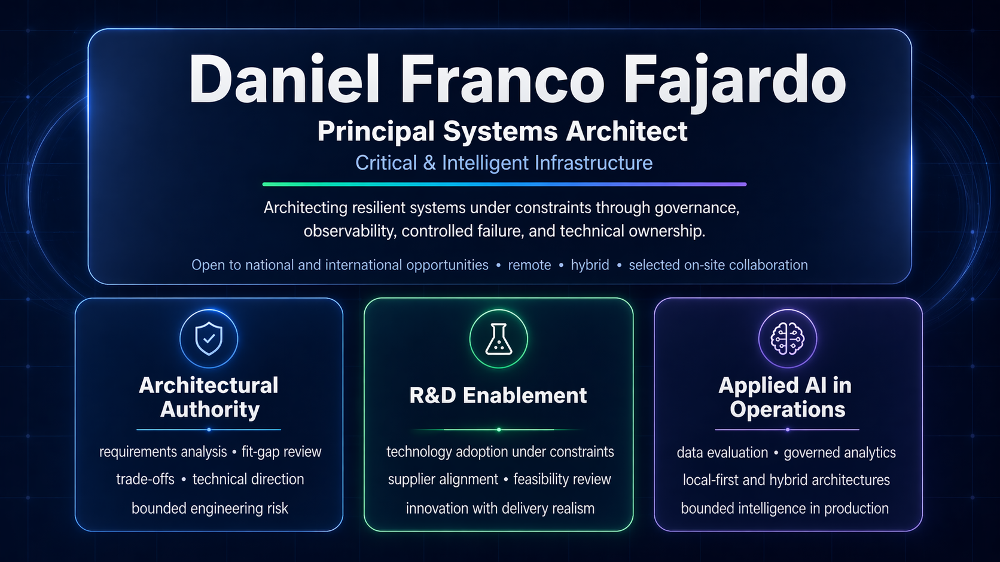
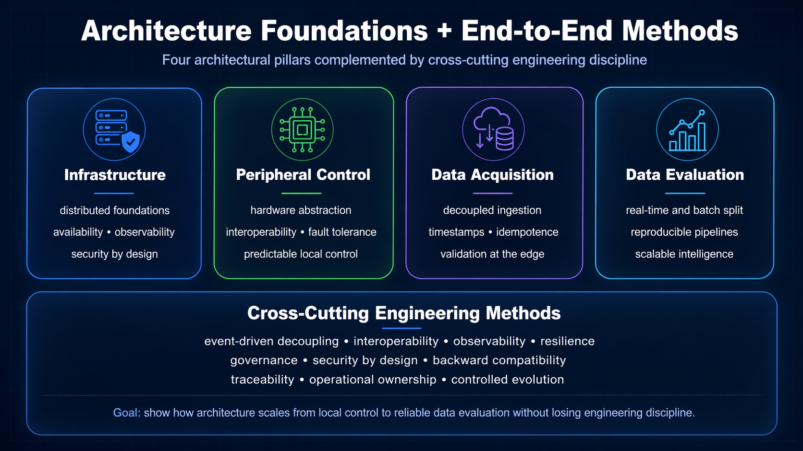

# Daniel Franco Fajardo — Professional Landing Page

Professional landing page for **Daniel Franco Fajardo**, focused on systems architecture, critical and intelligent infrastructure, resilient operations, and controlled public proof.

  

## Purpose

This repository publishes the public landing page for my professional portfolio.

The site provides a concise reading surface for:

- professional positioning;
- selected public work;
- architecture and methodology signals;
- publication-safe project evidence;
- contact and availability.

## Positioning

**Principal Systems Architect — Critical & Intelligent Infrastructure**

I design and govern systems that must remain reliable under real-world constraints across software, automation, edge infrastructure, data acquisition, and applied intelligence.

The emphasis is not technology theater. It is architectural judgment, traceability, controlled failure, operational reliability, and defensible public communication.

## Architecture & Methods

  

The methodological layer frames infrastructure, control, acquisition, evaluation, and delivery as a coherent engineering stack.

## Selected Public Work

| Project | Role | Public signal |
|---|---|---|
| [Probabilistic Seismic Risk Prototype](https://github.com/RelativoDrako/probabilistic-seismic-risk-prototype) | Flagship technical proof | Local-first probabilistic workflow, SQLite-backed authority, bounded interpretation, and traceable publication artifacts. |
| [inventory-stream7-rescue](https://github.com/RelativoDrako/inventory-stream7-rescue) | Operational tooling proof | Cross-platform rescue, inventory, diagnostics, and evidence-driven reporting for constrained systems. |
| [EdgeResilienceLab](https://github.com/RelativoDrako/edge-resilience-lab) | Publishable work in progress | Governed AI and resilient edge/OT architecture direction with human oversight, auditability, and local-first framing. |
| [GitHub Profile](https://github.com/RelativoDrako) | Portfolio index | Curated professional identity, selected evidence, links, and public proof navigation. |

## Contact

- GitHub: [github.com/RelativoDrako](https://github.com/RelativoDrako)
- LinkedIn: [linkedin.com/in/daniel-franco-b27572a8](https://linkedin.com/in/daniel-franco-b27572a8)
- Email: [relativomec@gmail.com](mailto:relativomec@gmail.com)

## Boundary

This site presents public professional positioning and selected bounded technical proofs.

It does not expose proprietary client code, confidential data, credentials, official warning systems, or production operational platforms.
